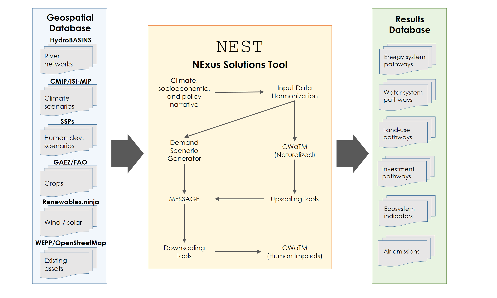
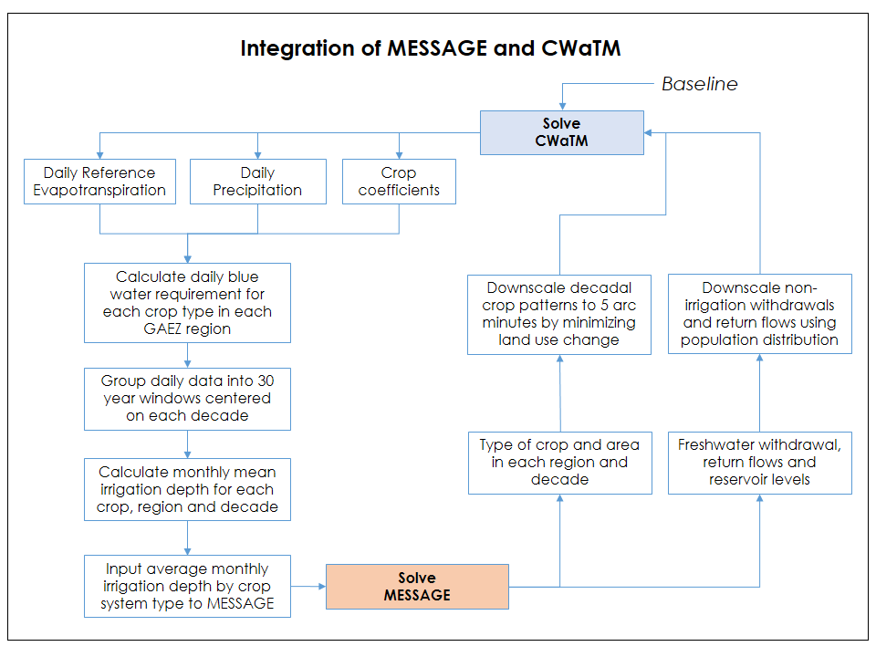

NEST links databases, processing scripts and state-of-the-art models covering multiple discplines (figure below). The framework simulates the expansion, retirement and operation of technologies to meet user-specficied demands across different sectors, and quantifies the impact of these development scenarios on the environment ensuring robust performance across specified indicators. NEST is supported by a geospatial database and interactive results processing tools. The geospatial database houses all relevant input data used for model parameterization and calibration. The post-processing tools aid analysis and aggregation into different indicators relevant for plannning and policy-making purposes. 

```{r, out.width = "800px", echo = FALSE}

```

NEST is a tool for scenario analysis. Scenarios in this context represent future pathways for water-energy-land systems under consistent sets of input data assumptions. Each scenario is defined by a narrative, which locks-in climate, socioeconomic and policy outcomes that in turn drives  harmonization and calibration of input data. Scenarios are compared to explore tradeoffs, synergies and uncertainties associated with alternative future outcomes.

System transformaton is simulated within NEST using [MESSAGE](https://messageix.iiasa.ac.at) (Model for Energy Supply Strategy Alternatives and their General Environmental impact). MESSAGE was originally designed as a linear programming (LP) energy-economic model, but is readily extended to any type of technological supply-chain involving interlinked technologies and commodities. Each technology is characterized by its input and output efficiency (i.e., the rate at which a particular commodity is consumed or produced during technology operation), costs (investment, fixed and variable components), and environmental impacts (e.g., greenhouse gas emissions untreated wastewater, etc.). MESSAGE minimizes the total system cost (water, energy and land) over a future time period while meeting user-specified levels of demand and other technical/policy constraints.

The soft-linking of MESSAGE and CWaTM within NEST provides a powerful platform to design future water-enegy-land system pathways that respond to water resource constraints and climate change. The Community Water Model ([CWatM](https://cwatm.github.io/)) provides a grid-based representation of terrestrial hydrology with current applications at a spatial resolution of 5 arc-minutes (grid-cells approximately 8 km wide near the equator) and daily temporal resolution [@Burek2018]. Similar to other large-scale hydrological models, CWaTM uses process-based equations to compute moisture storage in vertically stacked soil layers as well as the water exchange between the soil and the atmosphere and a groundwater reservoir. CWaTM is initially run under naturalized conditions (i.e., no withdrawals and return flows from human activties) to estimate run-off potentials and a baseline for calculating environmental flow indicators in MESSAGE. Elements of the resulting MESSAGE water system pathway are passed back to CWaTM to simulate the expected human impacts under adaptive management at a high spatial resolution. Up- and down-scaling tools facilitate the exchange of data across disparate spatial and temporal scales in CWaTM and MESSAGE.

# Systems integration

```{r, out.width = "650px", echo = FALSE, fig.align="center"}
knitr::include_graphics("figures/nest_message_crop_implement.png")
```

```{r, out.width = "500px", echo = FALSE, fig.align="center"}

```

```{r, out.width = "500px", echo = FALSE, fig.align="center"}

```


# Geographic scope

River basins are the fundamental spatial unit used in NEST, and are defined by geographic areas where all incident precipitation converted to runoff is directed towards a single outlet to the sea (or inland lake). River basins can be delineated using the [HydroBASINS](http://www.hydrosheds.org/page/hydrobasins) global dataset. Using hydrologically corrected digital elevation data from NASA's Shuttle Radar Topography Mission at 15 arc-second resolution, watersheds (or sub-basins) are delineated in a consistent manner in HydroBASINS at different scales, and a hierarchical sub-basin breakdown is created following the topological concept of the Pfafstetter coding system [@Lehner2013]. 

In NEST, river basins are dissaggregated into sub-basins to enable consistent tracking of within-basin surface water flows. To enable a transboundary perspective, NEST further intersects the sub-basin boundaries with country administrative units, e.g., from the Global Adminstrative Areas database ([GADM](https://gadm.org/)). Subnational adminstrative units and regions covering multiple basins can be included. The intersection of the administrative and sub-basin units results in a new classification of spatial units referred to as Basin Country Units (BCU). A reduced-form network is estimated between BCUs using flow-accumulation data from hydroBASINS at 15 arc-seconds. An example for the Indus river basin in South Asia is depicted below.

```{r, out.width = "800px", echo = FALSE}
knitr::include_graphics("figures/indus_map_cmb.png")
```

# Planning horizons

NEST is primarily implemented to explore long-term pathways spanning multiple decades because many of the decisions it covers involve infrastructure with long lifecycles (e.g., a new power plant can last for around 30 years). Moreover, relevant sustainable development policies usually focus on achieving targets many decades into the future in order to address adaptation to long-term sustainability challenges. For example, the Sustainable Development Goals (SDGs) aim for achievement by 2030, while climate change policies require an even longer perspective (e.g., at least out to mid-century). With this in mind, existing NEST applications are designed to look out to the year 2050. Monthly variations in supply and demand are also considered to incorporate potential bottlnecks caused by seasonal mismatches. Historical conditionals are calibrated to a baseyear representive of 2015 data. 

# Results explorer

The main outputs from NEST inlude the MESSAGE results providing projections over the planning horizon of the technology capacities, outputs and environmental impacts for each geographic region delineated in the model. MESSAGE data and results can be accessed and modified via the ix modeling platform, which enables version control and the ability to access and modify data online. Moreover, NEST generates water resource use and availability projections at a daily time-scale and 5 arc-minute spatial resolution consistent with CWaTM. To facilitate efficient browsing and sharing of the data with both technical and non-technical end-users, NEST is accompanied by an interactive web-based results explorer (figure below). 

```{r, out.width = "800px", echo = FALSE}
knitr::include_graphics("figures/nest_data_dashboard.png")
```

The explorer is tailored for specific applications and enables users to visualize and aggregate results for different regions and variables. Users can also export data directly for further analysis. The explorer is web-based and connects directly to the results database via post-processing tools. 

# Software dependencies

- R / Python. All data processing and configuration and running of the embedded models is performed via the free-to-use and download R / Python scientific programming environments. A number of 

- GAMS

# Getting started

Do you have a specific application for NEST? To get started, follow the instructions for downloading, installing and running MESSAGE and CWaTM as stand-alone platforms. This will provide the knowledge basis to successfully develop your own NEST model. Next, check out recent applications and associated links to github where the tools and data specific to each case study can be downloaded free-of-charge. Still stuck? Feel free to get in touch with members of our technical team to discuss your project. We are eager to collaborate!

# References