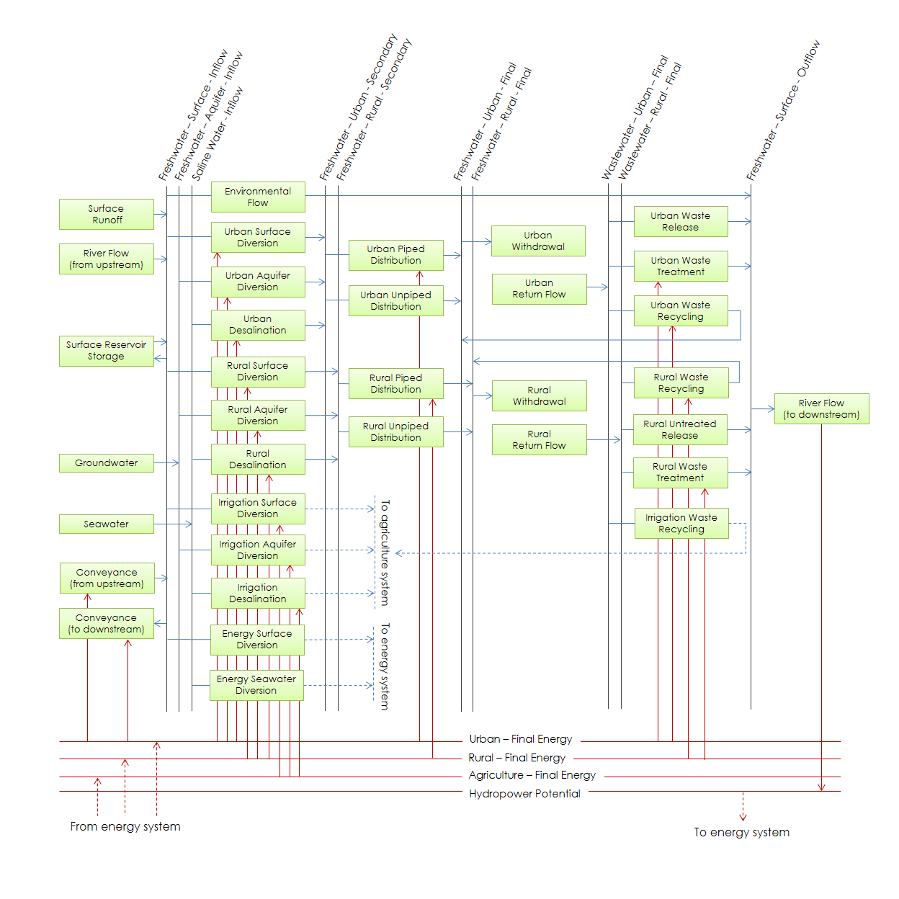
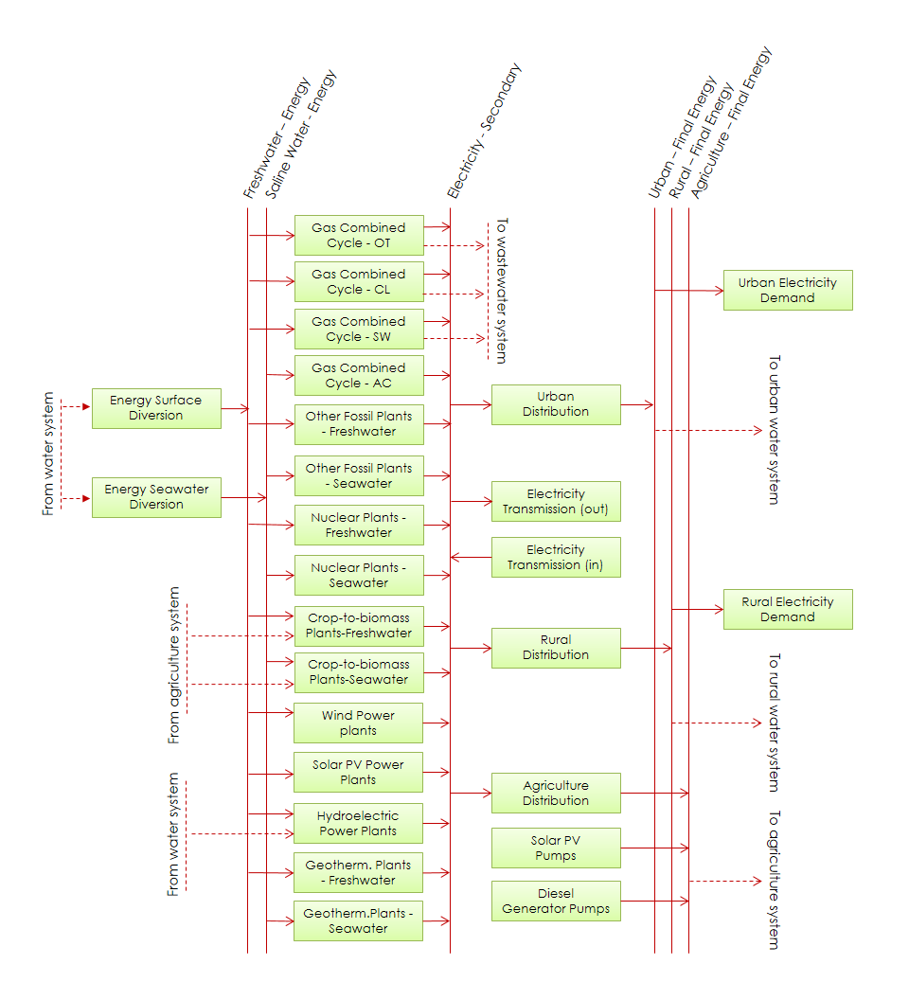
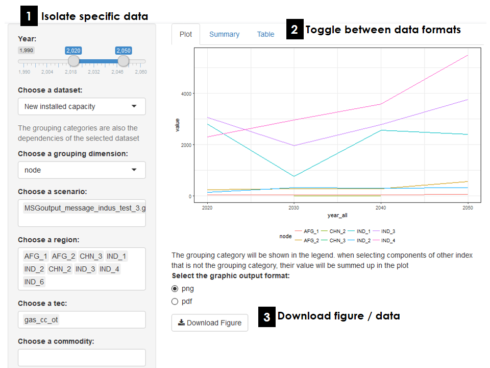

NEST links databases, processing scripts and state-of-the-art models covering multiple discplines (figure below). The framework simulates the expansion, retirement and operation of technologies to meet user-specficied demands across different sectors, and quantifies the impact of these development scenarios on the environment ensuring robust performance across specified indicators. NEST is supported by a geospatial database and interactive results processing tools. The geospatial database houses all relevant input data used for model parameterization and calibration. The post-processing tools aid analysis and aggregation into different indicators relevant for plannning and policy-making purposes. 

```{r, out.width = "800px", echo = FALSE}
knitr::include_graphics("figures/NEST_diagram.png")
```

NEST is a tool for scenario analysis. Scenarios in this context represent future pathways for WEE systems under consistent sets of input data assumptions. Each scenario is distinguished by a unique narrative, which locks-in climate, socioeconomic and policy outcomes that in turn drives harmonization of input data. Scenarios comprising different narratives (i.e., input data assumptions) are compared to explore tradeoffs, synergies and uncertainties associated with alternative future outcomes. 

The integrated basin development approach analyzed with NEST is based on the concept of inclusive growth through integration of natural assets and socio-economic development leading towards increasing economic opportunities across the basin.  NEST is implemented to explore long-term pathways spanning multiple decades because many of the modeled decisions involve infrastructure with long lifecycles (e.g., a new power plant can last for around 30 years). Moreover, relevant sustainable development policies for WEE systems usually focus on achieving targets many decades into the future in order to address adaptation to long-term sustainability challenges (e.g., the Sustainable Development Goals aim for achievement by 2030). 

# Infrastructure Transformation

System transformation is simulated within NEST using [MESSAGE](https://messageix.iiasa.ac.at/) (Model for Energy Supply Strategy Alternatives and their General Environmental impact). MESSAGE was originally designed as a linear programming (LP) energy-economic model, but is readily extended to any type of technological supply-chain involving interlinked technologies and commodities. In NEST, a diverse portfolio of water, energy and land technologies are defined and characterized by input and output efficiencies (i.e., the rate at which a particular commodity is consumed or produced during technology operation), costs (investment, fixed and variable components), and environmental impacts (e.g., greenhouse gas emissions untreated wastewater, etc.). By solving the following deterministic intertemporal LP problem, MESSAGE minimizes the total cost for water, energy and land systems simultaneously over a future time period while meeting user-specified levels of demand and technical/policy constraints: 

$$ \text{min} \, \sum_{t=1}^{n} \, \mathbf{c}_t^\text{T} \,  \mathbf{x_t} \, \delta_t \, , $$
$$ \mathbf{A} \, \mathbf{x} \, \geq \, \mathbf{b}, $$ 
$$ \mathbf{x} \, \geq \, 0  $$
In the above system of equations, the time period index is given by $t = 1,2,...,n$. The soluton vector containing the capacity and activity of the technologies is given by $\mathbf{x} = \left(\mathbf{x}_1,\mathbf{x}_2,...,\mathbf{x}_n\right)$.  Economic costs are described in the cost coefficient vector of the objective function $\mathbf{c}_t$. The discount rate associated with future cash flows is represented by $\delta_t$. The set of constraints including the supply-demand balances, capacity constraints and additional policies addressing system emissions are contained in the technical coefficent matrix $\mathbf{A}$ and right-hand side constraints vector $\mathbf{b}$.

The water resource and technology system representation using the MESSAGE reference system scheme is depicted in the figure below. Water from different sources (surface, ground and saline) is converted and allocated across sectors (urban, rural, energy and agriculture). Simultaneosuly, return-flow volumes are managed, including opportunities to recycle wastewater streams within and between sectors. Likewise, river flow and conveyance between spatial units is optimized. The current version of the model aggregates urban domestic and manufacturing uses to simplify the number of desicion variables. Nexus interactions across sectors are accounted for explicitly, including the energy required for pumping and treating water, and the water needed for crops and electricity generation. Hence, the water system pathways in NEST adapt to future changes in agriculture and energy systems. 

```{r, out.width = "750px", echo = FALSE, fig.align="center"}

```

The energy system representation using the MESSAGE reference scheme (figure below) primarily focuses on electricity and includes most types of fossil and low-carbon power generation. Wind and solar potentials are estimated using Renewables.Ninja, which generates hourly capacity factors for common photovoltaic and turbine technilogies at 3 arc minutes. Hydropower potential is linked to the flow between spatial units to enable interactions between up and down-stream uses. Exlcusion zones limit the capacity of the renewable generation and are defined based on existing land-use (population, protected habitat, forest cover, distance to population and existing projects). The energy pathways explored with NEST adapt to the future availability and cost of water and biomass supply.

```{r, out.width = "550px", echo = FALSE, fig.align="center"}

```

The land system using the MESSAGE reference scheme (figure below) primarily focuses on cropping systems. Existing and maximum yields for different crop types and management approaches are estimated using maps from the Global Agro-Ecological Zones (GAEZ) database. Yield varies with the amount of irrigation. On-farm energy requirements are estimated from data observed in the literature. Moreover, distinction is made between the type of energy carrier supporting agriculture activities (e.g., grid, diesel generation and distributed PV).

```{r, out.width = "650px", echo = FALSE, fig.align="center"}
knitr::include_graphics("figures/nest_message_crop_implement.png")
```

# Climate and Water Resources

The soft-linking of MESSAGE and CWaTM within NEST provides a powerful platform to design future water-enegy-land system pathways that respond to water resource constraints and climate change. The Community Water Model ([CWatM](https://cwatm.github.io/)) provides a grid-based representation of terrestrial hydrology with current applications at a spatial resolution of 5 arc-minutes (grid-cells approximately 8 km wide near the equator) and daily temporal resolution. Similar to other large-scale hydrological models, CWaTM uses process-based equations to compute moisture storage in vertically stacked soil layers as well as the water exchange between the soil and the atmosphere and a groundwater reservoir. CWaTM is initially run under naturalized conditions (i.e., no withdrawals and return flows from human activties) to estimate run-off potentials and a baseline for calculating environmental flow indicators in MESSAGE. Elements of the resulting MESSAGE water system pathway are passed back to CWaTM to simulate the expected human impacts under adaptive management at a high spatial resolution. Up- and down-scaling tools facilitate the exchange of data across disparate spatial and temporal scales in CWaTM and MESSAGE.

# Geographic scope

River basins are the fundamental spatial unit used in NEST, and are defined by geographic areas where all incident precipitation converted to runoff is directed towards a single outlet to the sea (or inland lake). River basins can be delineated using the [HydroBASINS](http://www.hydrosheds.org/page/hydrobasins) global dataset. Using hydrologically corrected digital elevation data from NASA's Shuttle Radar Topography Mission at 15 arc-second resolution, watersheds (or sub-basins) are delineated in a consistent manner in HydroBASINS at different scales, and a hierarchical sub-basin breakdown is created following the topological concept of the Pfafstetter coding system [@Lehner2013]. 

In NEST, river basins are dissaggregated into sub-basins to enable consistent tracking of within-basin surface water flows. To enable a transboundary perspective, NEST further intersects the sub-basin boundaries with country administrative units, e.g., from the Global Adminstrative Areas database ([GADM](https://gadm.org/)). Subnational adminstrative units and regions covering multiple basins can be included. The intersection of the administrative and sub-basin units results in a new classification of spatial units referred to as Basin Country Units (BCU). A reduced-form network is estimated between BCUs using flow-accumulation data from hydroBASINS at 15 arc-seconds. An example for the Indus river basin in South Asia is depicted below.

```{r, out.width = "800px", echo = FALSE}
knitr::include_graphics("figures/indus_map_cmb.png")
```

# Input data

# Results explorer

The main outputs from NEST inlude the MESSAGE results providing projections over the planning horizon of the technology capacities, outputs and environmental impacts for each geographic region delineated in the model. MESSAGE data and results can be accessed and modified via the ix modeling platform, which enables version control and the ability to access and modify data online. Moreover, NEST generates water resource use and availability projections at a daily time-scale and 5 arc-minute spatial resolution consistent with CWaTM. To facilitate efficient browsing and sharing of the data with both technical and non-technical end-users, NEST is accompanied by an interactive web-based results explorer (figure below). 

```{r, out.width = "800px", echo = FALSE}

```

The explorer is tailored for specific applications and enables users to visualize and aggregate results for different regions and variables. Users can also export data directly for further analysis. The explorer is web-based and connects directly to the results database via post-processing tools. 

# Software dependencies

- R / Python. All data processing and configuration and running of the embedded models is performed via the free-to-use and download R / Python scientific programming environments. A number of 

- GAMS

# Getting started

Do you have a specific application for NEST? To get started, follow the instructions for downloading, installing and running MESSAGE and CWaTM as stand-alone platforms. This will provide the knowledge basis to successfully develop your own NEST model. Next, check out recent applications and associated links to github where the tools and data specific to each case study can be downloaded free-of-charge. Still stuck? Feel free to get in touch with members of our technical team to discuss your project. We are eager to collaborate!

# References